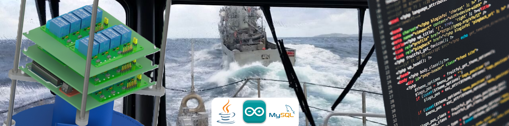

### Hi there I am Adrián Peñalver👋

# 💫 About Me:
🚀 Journeying Through: Currently, I'm studying the vocational training in DAW (Web Application Development) and computer engineering. 
🌠Team Ups: Looking for new challenges and collaborators for some of my projects, and if I can, help with yours. 
📘 Current Quest: Mastering web development, completing my engineering degree, and delving fully into the field of artificial intelligence. 
🔠My Specialty: My specialty has been electronics in the naval sector, both at sea and on land. Now, I'm looking to see what the IT sector can offer to this field. 
🌟 Did You Know?: I love mountain sports, big travels, and riding motorcycles.

## My current Langs

- Java 
- Arduino 
- SQL 

## My future Langs

- JavaScript 
- PHP 
- CSS 
- HTML 
- Laravel 
- Swing 

## My statistics

  

